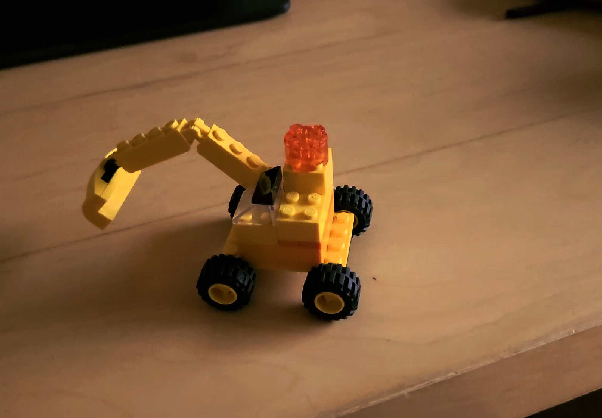
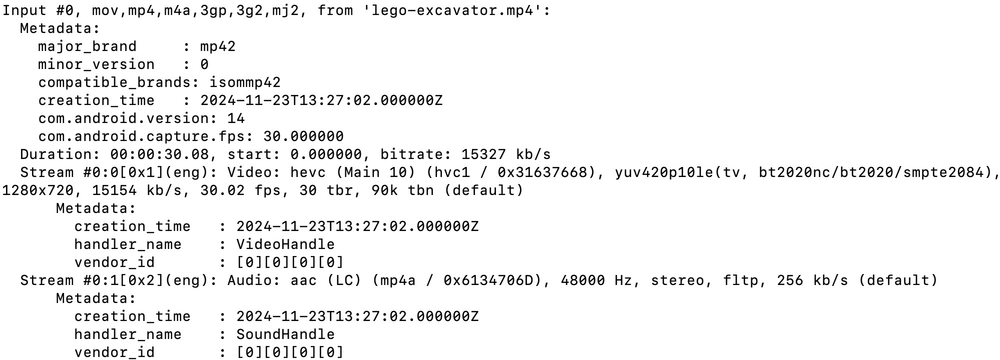
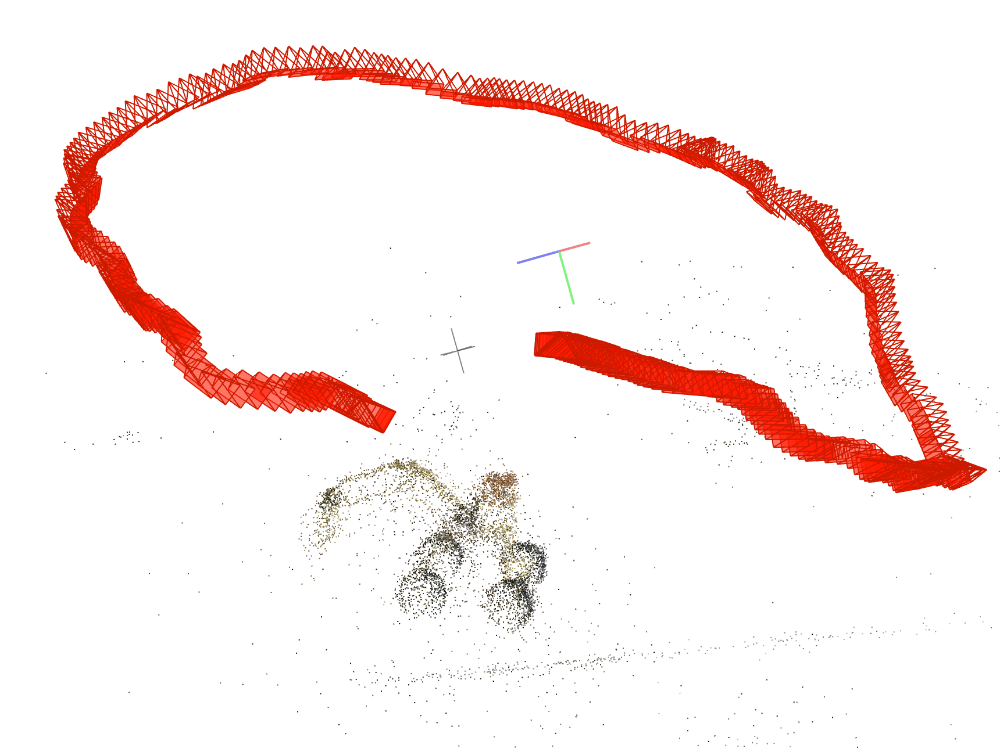

3D Gaussian Splatting (3DGS) is a technology that enables the rendering of realistic 2D images from any new viewpoint, using a 3D point cloud, a set of images, and their corresponding camera poses. In this article, I will demonstrate how to run a simple 3DGS experiment using your own data.

# Data preparation

## Video capture
My device was a Samsung Galaxy S23. I used the pro video mode and manually adjusted all settings to keep the camera parameters fixed. To avoid motion blur, it's better to use a fast shutter speed. A frame rate of 30 FPS is sufficient to ensure co-visibility between the image sequence.

## Video to images
Since I would use [Colmap](https://colmap.github.io/), which accepts images as input to generate a 3D point cloud, the video needed to be converted into an image sequence.
First, check the video's properties, such as pixel format, resolution, and frame rate.
```
ffmpeg -i lego-excavator.mp4
```
Here was the information about my video, frame rate was 30 FPS and pixel format was yuv420p10le.


<center>Figure1 Video info.</center>

To ensure higher image quality, I choosed to output images in PNG format. I also set frame rate to 10 FPS to reduce the total number of images.
```
ffmpeg -i lego-excavator.mp4 -vf format=yuv420p,fps=10 ./images/%04d.png
```
Note [Colmap](https://colmap.github.io/) only supports image with 8-bit pixel depth, so I didn't use yuv420p10le for the format parameter. 

# Generate 3D point cloud
I used [Colmap](https://colmap.github.io/) to reconstruct the scene from images and generate a 3D point cloud. The workflow involves feature extraction, feature matching, sparse reconstruction and dense reconstruction. For my data, the automatic reconstruction mode was sufficient to achieve high-quality 3D reconstruction result. In this mode, all parameters are pre-set and you just need to select the desired output quality. 

You can also manually adjust parameters for each step. In my opinion, most parameters don't required adjustment. I will discuss some of parameters that I consider important.\
Choosing an appropriate camera model is important. For images captured by smartphones, the PINHOLE or SIMPLE_RADIAL models are sufficient since the images have little distortion. However if you use wide-angle lens to capture images, a more complex model might yield better results.\
In feature extraction stage, enabling estimate_affine_shape and domain_size_pooling helps to generate better feature descriptors.\
In feature matching stage, select the sequential matching mode for images captured from a video, as this speeds up the matching process. Additionally, enable cross_check and guided_matching to ensure more accurate feature matching.\
For sparse reconstruction stage, increasing the number of iterations for both local and global bundle adjustment can improve the accuracy of the 3D reconstruction.\
Figure 2 shows the sparse reconstruction result of my data.


<center>Figure2 Sparse reconstruction result.</center>

Since I ran this experiment on my MacBook Air, which hadn't an NVIDIA GPU, I was unable to perform dense reconstruction.

# Train a 3DGS model
I used [OpenSplat](https://github.com/pierotofy/OpenSplat) to run 3D Gaussian Splatting. Simply clone the project, build it and run. 
```
cd your-OpenSplat-path
mkdir build && cd build
cmake -DCMAKE_PREFIX_PATH=/path/to/libtorch/ -DGPU_RUNTIME=MPS .. && make -j$(sysctl -n hw.logicalcpu)
./opensplat ~/dataset/LEGO-Excavator -n 10000 -o lego-excavator.splat
```
After training finished, the result will saved in a .splat file.

# Visualization with real-time renderer
I used this open source [viewer](https://github.com/antimatter15/splat?tab=readme-ov-file), which utilizes .splat files to visualize rendering results in real-time from any viewpoint. Figure 3 shows the rendering result of my data.


<center>Figure3 Render result from one perspective.</center>
