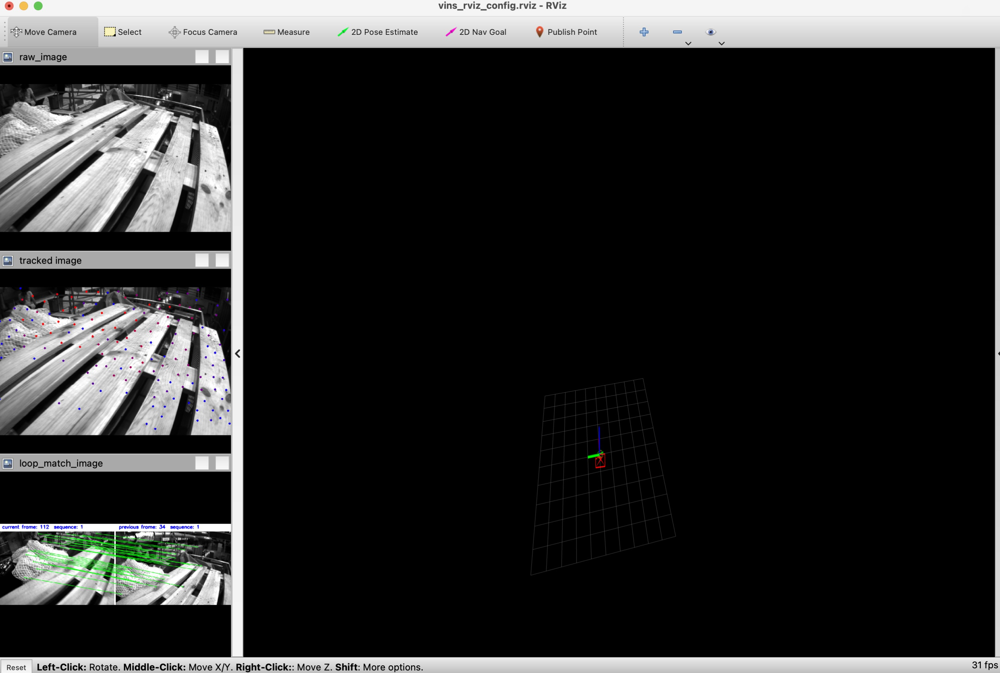

{: style="width: 400px; display: block; margin: auto;"}

[VINS-Mono](https://github.com/HKUST-Aerial-Robotics/VINS-Mono)[^1] is one of the most popular open-source visual SLAM systems. It utilizes the Robot Operating System (ROS) for data transformation and visualization. While building and running VINS-Mono on Linux is straightforward and well-documented on its GitHub page, attempting the same on macOS can present challenges. In this article, I will demonstrate how to set up VINS-Mono on a Macbook with Apple Silicon, a method that can also be applied to other ROS-based projects.

# Environment preparation
VINS-Mono relies on ROS1 to build and run. However, ROS1 does not natively support macOS. Thanks to [RoboStack](https://robostack.github.io/index.html)[^2], ROS1 can be easily and safely installed on macOS. It utilizes Conda to download prebuilt ROS-related libraries and tools into a customized path, creating a Conda environment. When this Conda environment is activated, the paths to the tools and libraries belongs to this environment automatically added to environment variables of current terminal, which makes the terminal transform into a required software environment. Then you can use ROS tools or build your ROS project directly in this terminal. For detailed installation steps, refer to RoboStack's homepage.

# Building VINS-Mono
After installing ROS1 via RoboStack and activating the ROS1 environment,
follow the steps on the VINS-Mono project page to build VINS-Mono. Ideally, the compilation should complete successfully. However, I encountered some unexpected problems.

### ROS Header Files Not Found
```
vins/src/VINS-Mono/vins_estimator/src/parameters.h:3:10:
fatal error: 'ros/ros.h' file not found
```
I printed the value of `${catkin_INCLUDE_DIRS}` in CMakeLists.txt and confirmed that the path to `ros/ros.h` was included. After several unsuccessful attempts of modifying CMakeLists.txt to resolve the issue, I decided to take a different approach. I manually added required path to the environment variable `CPATH` to ensure the compiler could locate the necessary header files.
```
export CPATH=$CPATH:/Users/xxx/miniforge3/envs/ros_env/include
```
To ensure this fix is applied consistently, I added a script containing the above command to the Conda environment's directory `etc/conda/activate.d`. Scripts in this directory are automatically executed when the environment is activated.
```
cd /Users/xxx/miniforge3/envs/ros_env/etc/conda/activate.d
nano env_vars.sh
```
Then add following lines to `env_vars.sh`.
```
#!/bin/bash
export CPATH=$CPATH:/Users/xxx/miniforge3/envs/ros_env/include
```

### Library compatibility issues on different platforms
```
vins/src/VINS-Mono/pose_graph/src/utility/utility.h:163:58:
error: use of undeclared identifier 'strdupa'; did you mean 'strdup'?
```
Compiler suggested a solution and it worked for building. I didn't thoroughly investigate potential runtime issues. At least, directly replacing it allowed the program to compile and execute without immediate crashes.

# Running VINS-Mono
Follow the steps on the VINS-Mono page to run the program with visualization. In my environment, I encountered RViz crash when I executed following command.
```
roslaunch vins_estimator vins_rviz.launch
```
I solved it by removing following line in the RViz config file named vins_rviz_config.rviz.
```
491 QMainWindow State: 000000ff00 ...
```

Finally, I successfully run VINS-Mono on my M3 MacBook Air.


<center>Figure1 Visualization of VINS-Mono.</center>

# References
[^1]: T. Qin, P. Li and S. Shen, "VINS-Mono: A Robust and Versatile Monocular Visual-Inertial State Estimator," in *IEEE Transactions on Robotics*, vol. 34, no. 4, pp. 1004-1020, Aug. 2018, doi: 10.1109/TRO.2018.2853729.
[^2]: T. Fischer, W. Vollprecht, S. Traversaro, S. Yen, C. Herrero and M. Milford, "A RoboStack Tutorial: Using the Robot Operating System Alongside the Conda and Jupyter Data Science Ecosystems," in *IEEE Robotics & Automation Magazine*, vol. 29, no. 2, pp. 65-74, June 2022, doi: 10.1109/MRA.2021.3128367.
