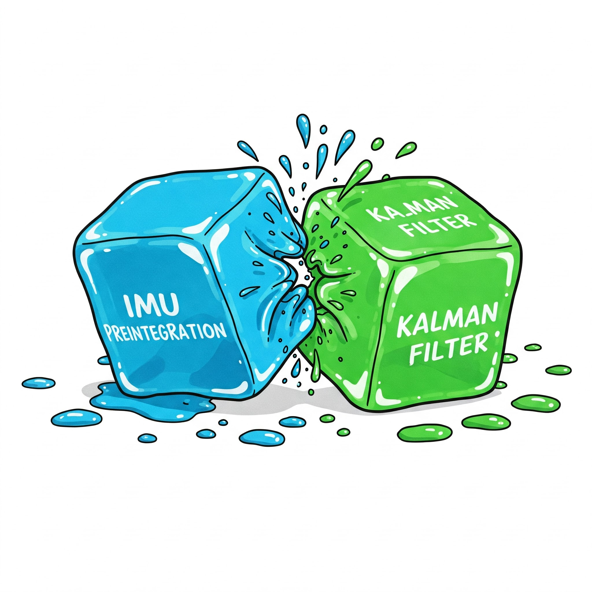

{: style="width: 400px; display: block; margin: auto;"}

In Kalman-filter-based visual-inertial odometry (VIO) system, inertial measurement unit (IMU), providing acceleration and angular velocity, is essential for state prediction and covariance propagation. However, processing each high-frequency IMU measurement for state update is computationally demanding, and it's not necessary in most of applications. 

To reduce computational load, IMU preintegration[^1] is applied, which integrates raw IMU data over a time interval to produce a pre-processed high-level measurement. With this technology, only a single filter prediction step is required, instead of implementing filter computation for each raw IMU data. 

In this article, I will show the state update and covariance propagation formulas for a Kalman filter using IMU preintegration measurements.

# Preliminaries
Consider a Kalman filter estimating following parameters: $$ X_k = [ ^{w}p_{b_k}, ^{w}v_{b_k}, ^{w}q_{b_k}, ba_k, bg_k ] $$, where $$ ^{w}p_{b_k}, ^{w}v_{b_k}, ^{w}q_{b_k} $$ are position, velocity and attitude of the body frame {b} in the global frame {w} at time step k. $$ ba_k $$ and $$ bg_k $$ are accelerometer and gyroscope biases at time step k, respectively.

Given the inertial measurement $$ u_k = [ \omega_{m_k}, \alpha_{m_k}] $$, where $$ \omega_{m_k} $$ and $$ \alpha_{m_k} $$ are measured acceleration and angular velocity at time step k, the state prediction step in the Kalman filter can be expressed as:

$$
X_{k+1} = f(X_k, u_k),
$$

By decomposing the state into an estimated component and an error component, the state can be expressed as $$ X_k = \hat{X}_k + \delta{X_k} $$.  Similarly, the measurement can be expressed as $$ u_k = u_k + w_k $$, where $$ w_k $$ is white Gaussian noise affecting the measurement.

The filter's state prediction step can then be rewritten as:

$$
\hat{X}_{k+1} + \delta{X_{k+1}} = f(\hat{X}_k + \delta{X_k} , u_k + w_k).
$$

After applying first-order linear approximation, the error state propogation formula can be achieved as:

$$
\hat{X}_{k+1} + \delta{X_{k+1}} = f(\hat{X}_k , u_k) + F \delta{X_k} + G w_k,
$$

$$
\delta{X_{k+1}} = F \delta{X_k} + G w_k,
$$

where $$ F $$ and $$ G $$ are jacobians of the state transformation function $$ f(\cdot) $$ with respect to the state $$ X_k $$ and the measurement $$ u_k $$, respectively.

# State prediction using IMU preintegration
Utilizing IMU preintegration, a batch of raw IMU data are integrated to produce three processed measurements $$ u_k = [P_{ij}, V_{ij}, q_{ij}] $$ with white Gaussian noise $$ w = [w_p, w_v, w_q] $$. More detailed derivations can refer to the paper[^1]. The state update from time step $$ i $$ to time step $$ j $$ using IMU preintegration is given by:

$$
^{w}P_{b_j} = {^{w}P_{b_i}} + {^{w}V_{b_i}} \delta{t} - 0.5 {^{w}g} {\delta{t}}^2 + {^{w}q_{b_i} P_{ij}},
$$

$$
^{w}V_{b_j} = {^{w}V_{b_i}} - {^{w}g} \delta{t} + {^{w}q_{b_i} V_{ij}},
$$

$$
^{w}q_{b_j} = {^{w}q_{b_i}} q_{ij},
$$

$$
ba_j = ba_i,
$$

$$
bg_j = bg_i,
$$

where $$ ^{w}g $$ is the gravity in the global frame.

# Covariance propagation
The jacobians of the state transformation function with respect to the state and the measurement can be expressed as:

$$
F =
\begin{bmatrix}
  I & \delta{t} I & -^{w}q_{b_i} {P_{ij}}^\wedge & {^{w}q_{b_i}} \frac{\partial P_{ij}}{\partial ba_i} & {^{w}q_{b_i}} \frac{\partial P_{ij}}{\partial bg_i} \\
  0 & I & -^{w}q_{b_i} {V_{ij}}^\wedge & {^{w}q_{b_i}} \frac{\partial V_{ij}}{\partial ba_i} & {^{w}q_{b_i}} \frac{\partial V_{ij}}{\partial bg_i} \\
  0 & 0 & {q_{ij}}^T & 0 & \frac{\partial q_{ij}}{\partial bg_i} \\
  0 & 0 & 0 & I & 0 \\
  0 & 0 & 0 & 0 & I
\end{bmatrix},
$$

$$
G =
\begin{bmatrix}
  {^{w}q_{b_i}} & 0 & 0 & 0 & 0 \\
  0 & {^{w}q_{b_i}} & 0 & 0 & 0 \\
  0 & 0 & I & 0 & 0 \\
  0 & 0 & 0 & I & 0 \\
  0 & 0 & 0 & 0 & I
\end{bmatrix}.
$$

Covariance propagation can be expressed as:

$$
P_j = F P_i F^T + G Q_i G^T,
$$

where $$ P $$ is the state covariance and $$ Q $$ is the measurement noise covariance. $$ Q $$ includes IMU preintegration noise and bias Random Walk noise, and takes the form as:

$$
Q_i =
\begin{bmatrix}
  {\sigma_{p_{ij}}}^2 & 0 & 0 & 0 & 0 \\
  0 & {\sigma_{v_{ij}}}^2 & 0 & 0 & 0 \\
  0 & 0 & {\sigma_{q_{ij}}}^2 & 0 & 0 \\
  0 & 0 & 0 & {\sigma_{ba}}^2 & 0 \\
  0 & 0 & 0 & 0 & {\sigma_{bg}}^2
\end{bmatrix}.
$$

# List of jacobian derivatives
Detailed formulas of IMU preintegration derivative with respect to IMU biases can refer to the supplementary material of the paper[^1].
### Position derivative with respect to states
$$
\frac{\partial ^{w}P_{b_j}}{\partial ^{w}P_{b_i}} = I
$$,

$$
\frac{\partial ^{w}P_{b_j}}{\partial ^{w}V_{b_i}} = \delta{t} I
$$,

$$
\frac{\partial ^{w}P_{b_j}}{\partial ^{w}q_{b_i}} = -^{w}q_{b_i} {P_{ij}}^\wedge
$$,

$$
\frac{\partial ^{w}P_{b_j}}{\partial ba_i} = \frac{\partial ^{w}P_{b_j}}{\partial P_{ij}} \frac{\partial P_{ij}}{\partial ba_i} = {^{w}q_{b_i}} \frac{\partial P_{ij}}{\partial ba_i}
$$,

$$
\frac{\partial ^{w}P_{b_j}}{\partial bg_i} = \frac{\partial ^{w}P_{b_j}}{\partial P_{ij}} \frac{\partial P_{ij}}{\partial bg_i} = {^{w}q_{b_i}} \frac{\partial P_{ij}}{\partial bg_i}
$$,

### Position derivative with respect to measurements
$$
\frac{\partial ^{w}P_{b_j}}{\partial P_{ij}} = {^{w}q_{b_i}}
$$.

### Linear velocity derivative with respect to states
$$
\frac{\partial ^{w}V_{b_j}}{\partial ^{w}P_{b_i}} = 0
$$,

$$
\frac{\partial ^{w}V_{b_j}}{\partial ^{w}V_{b_i}} = I
$$,

$$
\frac{\partial ^{w}V_{b_j}}{\partial ^{w}q_{b_i}} = -^{w}q_{b_i} {V_{ij}}^\wedge
$$,

$$
\frac{\partial ^{w}V_{b_j}}{\partial ba_i} = \frac{\partial ^{w}V_{b_j}}{\partial V_{ij}} \frac{\partial V_{ij}}{\partial ba_i} = {^{w}q_{b_i}} \frac{\partial V_{ij}}{\partial ba_i}
$$,

$$
\frac{\partial ^{w}V_{b_j}}{\partial bg_i} = \frac{\partial ^{w}V_{b_j}}{\partial V_{ij}} \frac{\partial V_{ij}}{\partial bg_i} = {^{w}q_{b_i}} \frac{\partial V_{ij}}{\partial bg_i}
$$,

### Linear velocity derivative with respect to measurements
$$
\frac{\partial ^{w}V_{b_j}}{\partial V_{ij}} = {^{w}q_{b_i}}
$$.

### Attitude derivative with respect to states
$$
\frac{\partial ^{w}q_{b_{j}}}{\partial ^{w}P_{b_i}} = 0
$$,

$$
\frac{\partial ^{w}q_{b_{j}}}{\partial ^{w}V_{b_i}} = 0
$$,

$$
\frac{\partial ^{w}q_{b_{j}}}{\partial ^{w}q_{b_{i}}} = {q_{ij}}^T
$$,

$$
\frac{\partial ^{w}q_{b_j}}{\partial ba_i} = 0
$$,

$$
\frac{\partial ^{w}q_{b_j}}{\partial bg_i} = \frac{\partial ^{w}q_{b_{j}}}{\partial q_{ij}} \frac{\partial q_{ij}}{\partial bg_i} = \frac{\partial q_{ij}}{\partial bg_i}
$$,

### Attitude derivative with respect to measurements
$$
\frac{\partial ^{w}q_{b_j}}{\partial q_{ij}} = I
$$.

### Accelerometer bias derivative with respect to states
$$
\frac{\partial ba_j}{\partial ba_i} = I
$$.

### Gyroscope bias derivative with respect to states
$$
\frac{\partial bg_j}{\partial bg_i} = I
$$.

# References
<!-- [^1]: J. Solà, "Quaternion kinematics for the error-state Kalman filter," arXiv preprint arXiv:1711.02508, 2017. -->
[^1]: C. Forster, L. Carlone, F. Dellaert and D. Scaramuzza, "On-Manifold Preintegration for Real-Time Visual--Inertial Odometry," in *IEEE Transactions on Robotics*, vol. 33, no. 1, pp. 1-21, Feb. 2017, doi: 10.1109/TRO.2016.2597321.
